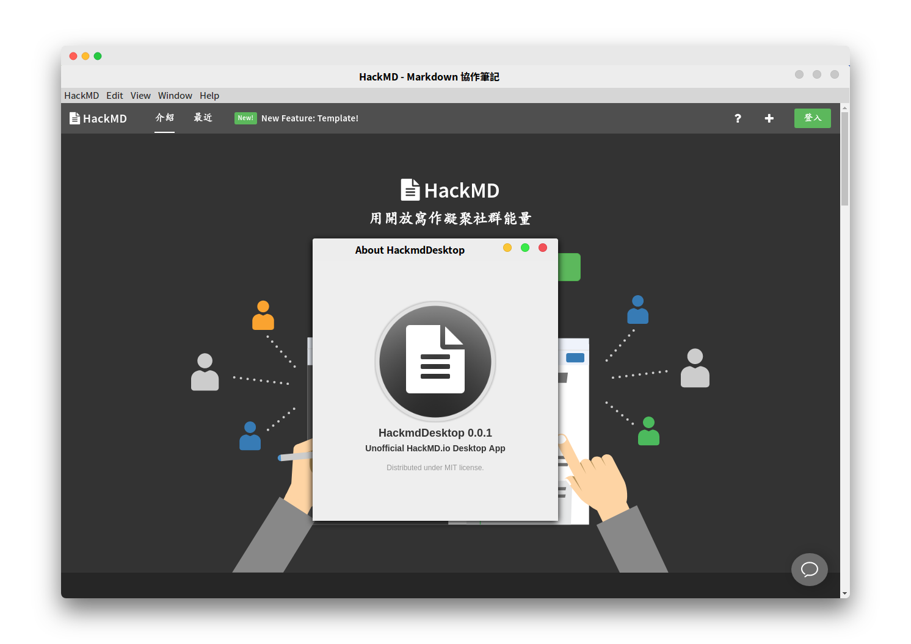
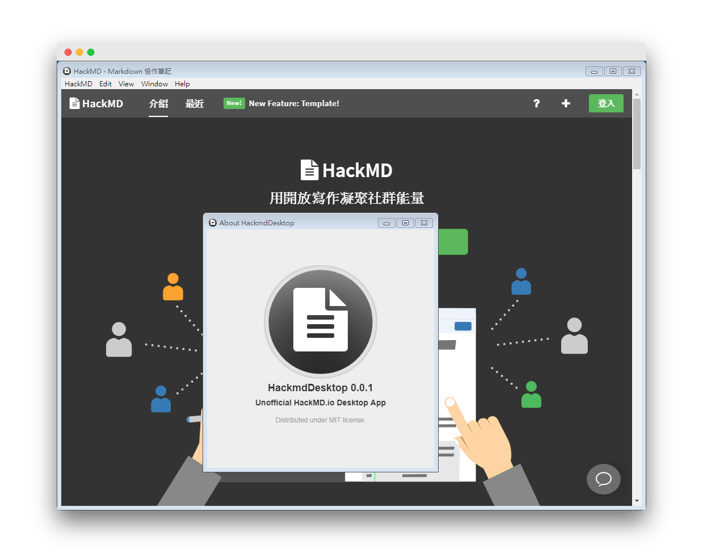
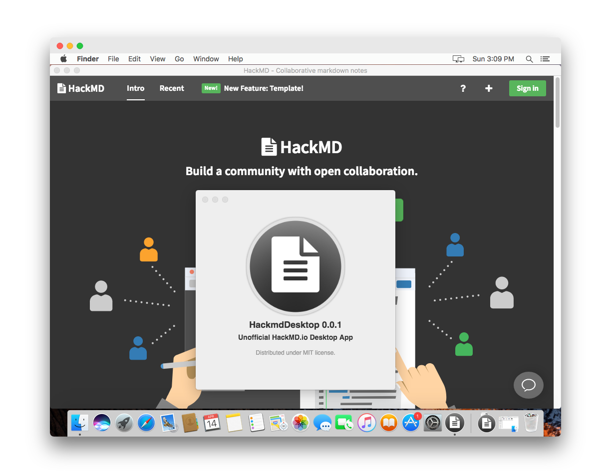

# HackmdDesktop 

Desktop app for [HackMD][hackmd] packaged with [Electron][electron].

If you don't like the [official app](https://github.com/hackmdio/hackmd-desktop), try out this app.

This Electron-based app is written by the codes which are different from the official app.

Linux


Windows


Mac


## Install

The softwares are portable, just unpack the zip file then run it. 

Go to [Release][release] to download the packages for all OS.

## Optional: Create Electron Development

```sh
git clone https://github.com/a-lang/hackmd.git
cd hackmd
npm install
```

## Optional: Build the distribution files

Build the application for specified platform:

```sh
npm run start
npm run dist:linux
npm run dist:macos
npm run dist:win
```

## License
Active Record is released under the [MIT license][license]

[hackmd]: https://hackmd.io
[electron]: http://electron.atom.io
[license]: https://opensource.org/licenses/MIT
[release]: https://github.com/a-lang/hackmd/releases